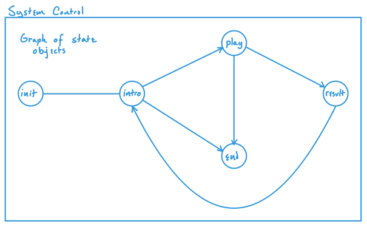

# FarOut
An Open Source 2D Space Game Library for SFML 

Amila Ferron, Mack Foggia, Taylor Noah, and Jeffrey Jernstrom 2021

## Overview

This repository contains a library that extends SFML to provide functionality to create simple 2D space-themed games. It includes a data structure of scenes, methods for navigation between the scenes, menu creation, and graphical elements including a ship, astronomical bodies, and an infinite background of stars.

### Context Control System

The "Context Control System" address the need for a game's overall structure and manages game resources at the highest level. 
State machine

### Graphics

Scenes are populated with a collection of example game objects and graphical elements. Game objects include a ship, alien ship, and other objects potentially found in space and are made using SFML's graphics module including sprites, shapes, and textures. 

### Data

Scenes are organized in a graph and information for each session stored externally.

## Build Instruction

On Linux, <a href=https://www.sfml-dev.org/tutorials/2.5/start-linux.php>here</a> are instructions on installing SFML and compiling a program.

## Project Roadmap

### Prototype

The project demo will consist of a single scene where a ship is controlled by a player to move across a starfield background encountering other game objects. This will be completed by the end of week 3.

### Minimum Viable Product

A completed project will include, at least, a "Context Control System" to navigate through the scenes, multiple levels of play, menus, a looping background of stars, a ship, and another game object of our choosing. This will be completed by the end of week 6.

### Post-class Plans

After the course is completed, the range of characters and game objects will be expanded and features will be added to allow saving a user's games and information and move into to multi-player networking.

### Similar Work
-SDL Check them out [here](https://www.libsdl.org/).

## Acknowledgments 

